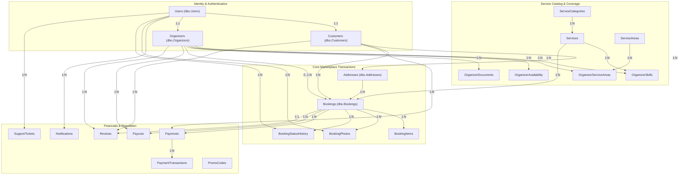

# Nestify Home Organization Marketplace - Entity Relationship Diagram (ERD)

This document provides the complete visual entity-relationship structure for **NestifyDB**, the production Microsoft SQL Server database powering the Nestify Marketplace.

---

## 1. High-Level Marketplace Domain Map

---

## 2. Detailed Relational Schema Diagram (Mermaid ERD)

```mermaid
erDiagram
    Users ||--|| Customers : "1:1 registers as"
    Users ||--|| Organizers : "1:1 registers as"
    Users ||--o{ Notifications : "receives"
    Users ||--o{ BookingPhotos : "uploads"
    Users ||--o{ BookingStatusHistory : "authorizes"
    Users ||--o{ OrganizerDocuments : "verifies"
    Users ||--o{ SupportTickets : "admin assigned"

    Customers ||--o{ Addresses : "maintains"
    Customers ||--o{ Bookings : "creates"
    Customers ||--o{ Payments : "pays"
    Customers ||--o{ Reviews : "writes"
    Customers ||--o{ SupportTickets : "opens"

    Organizers ||--o{ OrganizerSkills : "specializes in"
    Organizers ||--o{ OrganizerServiceAreas : "covers"
    Organizers ||--o{ OrganizerAvailability : "sets schedule"
    Organizers ||--o{ OrganizerDocuments : "uploads verification"
    Organizers ||--o{ Bookings : "assigned to"
    Organizers ||--o{ Payouts : "receives earnings"
    Organizers ||--o{ Reviews : "rated on"
    Organizers ||--o{ SupportTickets : "files"

    ServiceCategories ||--o{ Services : "classifies"
    Services ||--o{ OrganizerSkills : "tagged to"
    Services ||--o{ Bookings : "booked for"

    ServiceAreas ||--o{ OrganizerServiceAreas : "defines perimeter"

    Addresses ||--o{ Bookings : "service location"

    Bookings ||--o{ BookingItems : "itemized in"
    Bookings ||--o{ BookingPhotos : "visualized in"
    Bookings ||--o{ BookingStatusHistory : "audited by"
    Bookings ||--o{ Payments : "billed by"
    Bookings ||--o{ Payouts : "triggers payout"
    Bookings ||--o| Reviews : "reviewed by"
    Bookings ||--o{ SupportTickets : "referenced in"

    Payments ||--o{ PaymentTransactions : "gateway attempts"

    Users {
        BIGINT UserID PK
        NVARCHAR LoginID UK "NOT NULL"
        NVARCHAR PasswordHash "NOT NULL"
        NVARCHAR Role "Customer, Organizer, Admin"
        BIT IsActive "DEFAULT 1"
        DATETIME2 CreatedDate "DEFAULT SYSUTCDATETIME()"
        DATETIME2 UpdatedDate "NULL"
        DATETIME2 LastLoginDate "NULL"
    }

    Customers {
        BIGINT CustomerID PK
        BIGINT UserID FK,UK "NOT NULL"
        NVARCHAR FullName "NOT NULL"
        NVARCHAR Phone "NOT NULL"
        NVARCHAR Email "NULL"
        NVARCHAR ProfilePhotoURL "NULL"
        NVARCHAR Status "Active, Inactive, Suspended"
        DATETIME2 CreatedDate "DEFAULT SYSUTCDATETIME()"
        DATETIME2 UpdatedDate "NULL"
    }

    Organizers {
        BIGINT OrganizerID PK
        BIGINT UserID FK,UK "NOT NULL"
        NVARCHAR FullName "NOT NULL"
        NVARCHAR Phone "NOT NULL"
        NVARCHAR Email "NULL"
        NVARCHAR ProfilePhotoURL "NULL"
        DECIMAL ExperienceYears "NULL"
        NVARCHAR VerificationStatus "Pending, Approved, Rejected"
        NVARCHAR ApprovalStatus "Pending, Approved, Rejected, Suspended"
        DECIMAL Rating "DEFAULT 0.00"
        INT CompletedJobs "DEFAULT 0"
        BIT IsActive "DEFAULT 1"
        DATETIME2 CreatedDate "DEFAULT SYSUTCDATETIME()"
        DATETIME2 UpdatedDate "NULL"
    }

    ServiceCategories {
        BIGINT CategoryID PK
        NVARCHAR CategoryName "NOT NULL"
        NVARCHAR Description "NULL"
        NVARCHAR ImageURL "NULL"
        INT DisplayOrder "DEFAULT 0"
        BIT IsActive "DEFAULT 1"
        DATETIME2 CreatedDate "DEFAULT SYSUTCDATETIME()"
        DATETIME2 UpdatedDate "NULL"
    }

    Services {
        BIGINT ServiceID PK
        BIGINT CategoryID FK "NOT NULL"
        NVARCHAR ServiceName "NOT NULL"
        NVARCHAR Description "NULL"
        NVARCHAR IncludedDetails "NULL"
        NVARCHAR ExcludedDetails "NULL"
        DECIMAL StartingPrice "NOT NULL"
        DECIMAL EstimatedDuration "NULL"
        NVARCHAR ImageURL "NULL"
        BIT IsActive "DEFAULT 1"
        DATETIME2 CreatedDate "DEFAULT SYSUTCDATETIME()"
        DATETIME2 UpdatedDate "NULL"
    }

    OrganizerSkills {
        BIGINT OrganizerSkillID PK
        BIGINT OrganizerID FK "NOT NULL"
        BIGINT ServiceID FK "NOT NULL"
        DECIMAL ExperienceYears "NULL"
        BIT IsActive "DEFAULT 1"
        DATETIME2 CreatedDate "DEFAULT SYSUTCDATETIME()"
    }

    ServiceAreas {
        BIGINT ServiceAreaID PK
        NVARCHAR AreaName "NOT NULL"
        NVARCHAR City "NOT NULL"
        NVARCHAR State "NULL"
        NVARCHAR PostalCode "NULL"
        DECIMAL Latitude "NULL"
        DECIMAL Longitude "NULL"
        BIT IsActive "DEFAULT 1"
        DATETIME2 CreatedDate "DEFAULT SYSUTCDATETIME()"
    }

    OrganizerServiceAreas {
        BIGINT OrganizerServiceAreaID PK
        BIGINT OrganizerID FK "NOT NULL"
        BIGINT ServiceAreaID FK "NOT NULL"
        BIT IsActive "DEFAULT 1"
        DATETIME2 CreatedDate "DEFAULT SYSUTCDATETIME()"
    }

    OrganizerAvailability {
        BIGINT AvailabilityID PK
        BIGINT OrganizerID FK "NOT NULL"
        DATE AvailabilityDate "NULL (Specific)"
        TINYINT DayOfWeek "NULL (0=Sun, 1=Mon...)"
        TIME StartTime "NOT NULL"
        TIME EndTime "NOT NULL"
        BIT IsAvailable "DEFAULT 1"
        BIT IsBlocked "DEFAULT 0"
        DATETIME2 CreatedDate "DEFAULT SYSUTCDATETIME()"
        DATETIME2 UpdatedDate "NULL"
    }

    Addresses {
        BIGINT AddressID PK
        BIGINT CustomerID FK "NOT NULL"
        NVARCHAR AddressLabel "NOT NULL"
        NVARCHAR AddressLine1 "NOT NULL"
        NVARCHAR AddressLine2 "NULL"
        NVARCHAR City "NOT NULL"
        NVARCHAR State "NULL"
        NVARCHAR PostalCode "NULL"
        NVARCHAR Landmark "NULL"
        DECIMAL Latitude "NULL"
        DECIMAL Longitude "NULL"
        BIT IsDefault "Single default per customer"
        DATETIME2 CreatedDate "DEFAULT SYSUTCDATETIME()"
        DATETIME2 UpdatedDate "NULL"
    }

    Bookings {
        BIGINT BookingID PK
        BIGINT CustomerID FK "NOT NULL"
        BIGINT OrganizerID FK "NULL"
        BIGINT ServiceID FK "NOT NULL"
        BIGINT AddressID FK "NOT NULL"
        DATE BookingDate "NOT NULL"
        TIME StartTime "NOT NULL"
        DECIMAL EstimatedDuration "NULL"
        NVARCHAR Status "Controlled Lifecycle"
        NVARCHAR PaymentStatus "Pending, Success, etc."
        DECIMAL BaseAmount "DEFAULT 0.00"
        DECIMAL ServiceFee "DEFAULT 0.00"
        DECIMAL DiscountAmount "DEFAULT 0.00"
        DECIMAL TotalAmount "DEFAULT 0.00"
        NVARCHAR CustomerNotes "NULL"
        DATETIME2 CreatedDate "DEFAULT SYSUTCDATETIME()"
        DATETIME2 UpdatedDate "NULL"
    }

    BookingItems {
        BIGINT BookingItemID PK
        BIGINT BookingID FK "NOT NULL"
        NVARCHAR ItemType "NULL"
        NVARCHAR ItemName "NOT NULL"
        DECIMAL Quantity "NULL"
        DECIMAL UnitPrice "NULL"
        DECIMAL Amount "NULL"
        NVARCHAR Notes "NULL"
        DATETIME2 CreatedDate "DEFAULT SYSUTCDATETIME()"
    }

    BookingPhotos {
        BIGINT BookingPhotoID PK
        BIGINT BookingID FK "NOT NULL"
        NVARCHAR PhotoType "Request, Before, After"
        NVARCHAR FileName "NULL"
        NVARCHAR FileURL "NOT NULL"
        NVARCHAR StorageKey "NULL"
        BIGINT UploadedByUserID FK "NOT NULL"
        DATETIME2 CreatedDate "DEFAULT SYSUTCDATETIME()"
    }

    Payments {
        BIGINT PaymentID PK
        BIGINT BookingID FK "NOT NULL"
        BIGINT CustomerID FK "NOT NULL"
        DECIMAL Amount "NOT NULL"
        CHAR CurrencyCode "USD, EUR, etc."
        NVARCHAR PaymentMethod "CreditCard, ApplePay, etc."
        NVARCHAR GatewayName "Stripe, PayPal, etc."
        NVARCHAR GatewayReference "Transaction/Charge ID"
        NVARCHAR PaymentStatus "Pending, Success, Failed"
        DATETIME2 PaidDate "NULL"
        DATETIME2 CreatedDate "DEFAULT SYSUTCDATETIME()"
        DATETIME2 UpdatedDate "NULL"
    }

    PaymentTransactions {
        BIGINT TransactionID PK
        BIGINT PaymentID FK "NOT NULL"
        NVARCHAR GatewayReference "NULL"
        NVARCHAR TransactionType "Authorize, Capture, Refund"
        DECIMAL Amount "NOT NULL"
        NVARCHAR Status "Pending, Success, Failed"
        NVARCHAR ResponsePayload "JSON payload"
        DATETIME2 CreatedDate "DEFAULT SYSUTCDATETIME()"
    }

    Payouts {
        BIGINT PayoutID PK
        BIGINT OrganizerID FK "NOT NULL"
        BIGINT BookingID FK "NOT NULL"
        DECIMAL GrossAmount "NOT NULL"
        DECIMAL PlatformFee "NOT NULL"
        DECIMAL NetAmount "NOT NULL"
        NVARCHAR PayoutStatus "Pending, Processing, Paid, Failed"
        NVARCHAR PayoutReference "Transfer/ACH reference"
        DATETIME2 PayoutDate "NULL"
        DATETIME2 CreatedDate "DEFAULT SYSUTCDATETIME()"
    }

    Reviews {
        BIGINT ReviewID PK
        BIGINT BookingID FK,UK "NOT NULL (1 per booking)"
        BIGINT CustomerID FK "NOT NULL"
        BIGINT OrganizerID FK "NOT NULL"
        TINYINT Rating "1 to 5"
        NVARCHAR ReviewText "NULL"
        BIT IsPublished "DEFAULT 1"
        DATETIME2 CreatedDate "DEFAULT SYSUTCDATETIME()"
        DATETIME2 UpdatedDate "NULL"
    }

    Notifications {
        BIGINT NotificationID PK
        BIGINT UserID FK "NOT NULL"
        NVARCHAR Title "NOT NULL"
        NVARCHAR Message "NOT NULL"
        NVARCHAR NotificationType "NOT NULL"
        BIGINT ReferenceID "NULL (BookingID, etc.)"
        BIT IsRead "DEFAULT 0"
        DATETIME2 SentDate "NULL"
        DATETIME2 CreatedDate "DEFAULT SYSUTCDATETIME()"
    }

    PromoCodes {
        BIGINT PromoCodeID PK
        NVARCHAR Code UK "NOT NULL"
        NVARCHAR Description "NULL"
        NVARCHAR DiscountType "Percentage, Fixed"
        DECIMAL DiscountValue "NOT NULL"
        DECIMAL MinimumAmount "NULL"
        DECIMAL MaximumDiscount "NULL"
        DATETIME2 ValidFrom "NOT NULL"
        DATETIME2 ValidTo "NOT NULL"
        INT UsageLimit "NULL"
        INT UsedCount "DEFAULT 0"
        BIT IsActive "DEFAULT 1"
        DATETIME2 CreatedDate "DEFAULT SYSUTCDATETIME()"
        DATETIME2 UpdatedDate "NULL"
    }

    SupportTickets {
        BIGINT SupportTicketID PK
        BIGINT CustomerID FK "NULL"
        BIGINT OrganizerID FK "NULL"
        BIGINT BookingID FK "NULL"
        NVARCHAR Category "NOT NULL"
        NVARCHAR Description "NOT NULL"
        NVARCHAR Status "Open, InReview, Resolved, Closed"
        BIGINT AssignedAdminID FK "NULL"
        NVARCHAR ResolutionNotes "NULL"
        DATETIME2 CreatedDate "DEFAULT SYSUTCDATETIME()"
        DATETIME2 UpdatedDate "NULL"
        DATETIME2 ClosedDate "NULL"
    }

    OrganizerDocuments {
        BIGINT DocumentID PK
        BIGINT OrganizerID FK "NOT NULL"
        NVARCHAR DocumentType "Identity, AddressProof, etc."
        NVARCHAR FileURL "NOT NULL"
        NVARCHAR VerificationStatus "Pending, Approved, Rejected"
        BIGINT VerifiedBy FK "NULL"
        DATETIME2 VerifiedDate "NULL"
        DATETIME2 CreatedDate "DEFAULT SYSUTCDATETIME()"
    }

    BookingStatusHistory {
        BIGINT HistoryID PK
        BIGINT BookingID FK "NOT NULL"
        NVARCHAR OldStatus "NULL"
        NVARCHAR NewStatus "NOT NULL"
        BIGINT ChangedByUserID FK "NOT NULL"
        NVARCHAR Remarks "NULL"
        DATETIME2 ChangedDate "DEFAULT SYSUTCDATETIME()"
    }
```

